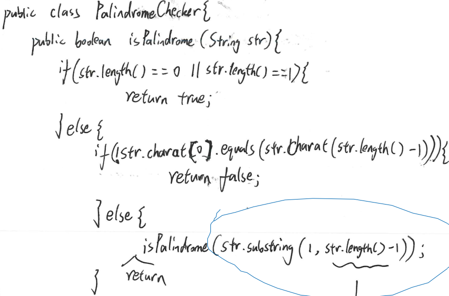
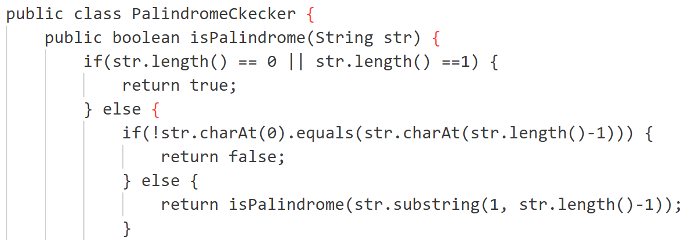
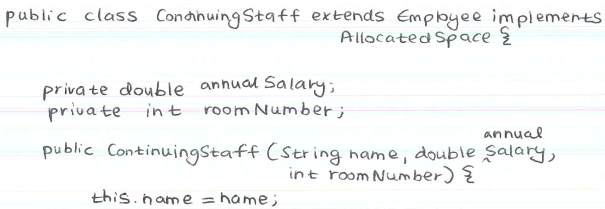
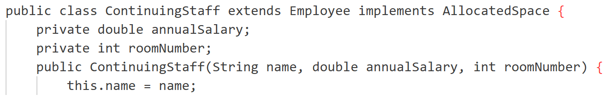
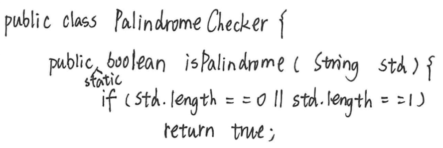
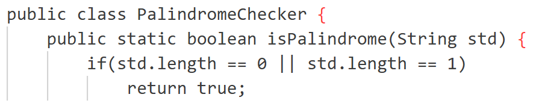

# OCR System with Multi-Service Integration


A system that performs Optical Character Recognition (OCR) on handwritten exam papers using multiple cloud services. The system supports various OCR providers and includes image preprocessing, error measurement, and result comparison capabilities.

# Table of Contents

- [OCR System with Multi-Service Integration](#ocr-system-with-multi-service-integration)
- [Table of Contents](#table-of-contents)
- [Docker Setup (Optional)](#docker-setup-optional)
- [GitHub Setup](#github-setup)
- [OCR/LLM API Setup](#ocrllm-api-setup)
  - [Prerequisites](#prerequisites)
  - [Setup Steps](#setup-steps)
- [File Explanation](#file-explanation)
- [System Run](#system-run)
  - [Basic Usage](#basic-usage)
- [Results](#results)
  - [Paper 107](#paper-107)
    - [Raw Image](#raw-image)
    - [Transcribed Image](#transcribed-image)
  - [Paper 115](#paper-115)
    - [Raw Image](#raw-image-1)
    - [Transcribed Image](#transcribed-image-1)
  - [Paper 138](#paper-138)
    - [Raw Image](#raw-image-2)
    - [Transcribed Image](#transcribed-image-2)

# Docker Setup (Optional)

Create a .devcontainer folder on the root with a devcontainer.json and a Dockerfile. Read the Docker and VSCode documentation for contents.

Download "Containers" extension for VSCode, then go to VSCode Command Prompt (or Ctrl + Shift + P or press F1) and search for "Dev Container: Build...", then select the folder that contains the .devcontainer.

# GitHub Setup

Use .gitignore to ignore confidential/large files such as .env, images, etc.

# OCR/LLM API Setup

## Prerequisites
- Python 3.8 or higher
- Docker (optional)
- API keys for supported services

## Setup Steps
1. Clone the repository:
   ```bash
   git clone <repository-url>
   cd <repository-name>
   ```

2. Install dependencies:
   ```bash
   pip install -r requirements.txt
   ```

3. Configure API credentials:
   - Create a `.env` file in the project root
   - Add your API keys (see `.env.example` for format)

4. Service-specific setup:
   - Go to the service provider's website
   - Sign up for an account
   - Generate an API key (keep it secure, never commit to Git)
   - Review API documentation and examples
   - Choose appropriate model/endpoint
   - Check API call limits and pricing

5. Configure processing:
   - Add your service configuration in `utils.py`
   - Update `PROCESSED_OCR_IMAGES` in config to select target images

# File Explanation

1.  `<service>_<ocr/cot>.py` are files used to run OCR from a <service> API (e.g., **azure_ocr** runs **Azure's** API service).
2.  `compress_images.py` is used to compress raw images, raw images should be located in `images/raw` folder. Raw images are usually large, which can cause some services to reject the images (e.g., Claude requires each image's size in bytes to be at most 5 MB).
3.  `measure_errors.py` is used to calculate **Normalised Levenshtein Distance (NLD)** by pairing results in the results folder with its counterparts in `ground_truth` folder.
4.  `utils.py` contains utilities needed to modulise the system.
5.  `requirements.txt` is used to keep track of dependencies, it can be installed by running `pip install -r requirements.txt`.

# System Run

## Basic Usage
```bash
# Run OCR with specific service
python <service>_ocr.py

# Run Chain-of-Thought processing
python <service>_cot.py

# Compress new images
python compress_images.py

# Measure accuracy
python measure_errors.py
```

# Results

This section demonstrates the system's OCR capabilities across different handwritten exam papers.

## Paper 107
This example showcases the system's ability to handle clear handwriting with a caret insertion and missing closing brackets.

### Raw Image
<div align="center">
  
</div>

### Transcribed Image
<div align="center">
  
</div>

## Paper 115
Demonstrates the system's performance in handling text insertion and missing closing brackets.

### Raw Image
<div align="center">
  
</div>

### Transcribed Image
<div align="center">
  
</div>

## Paper 138
Shows the system's capability in handling upward caret insertion and missing closing brackets.

### Raw Image
<div align="center">
  
</div>

### Transcribed Image
<div align="center">
  
</div>
